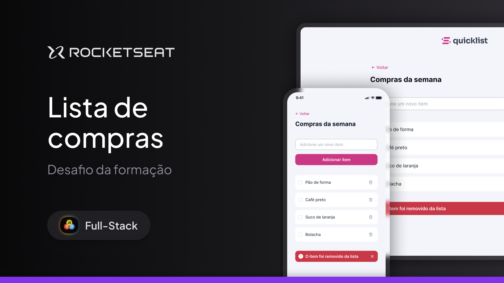

# 🛒 Quicklist

Um site simples e responsivo para gerenciar sua **lista de compras**, desenvolvido como parte dos desafios da Rocketseat.



---

## 🚀 Tecnologias

Esse projeto foi construído com:

- **HTML5** e **CSS3**
- **JavaScript (DOM, Events)**
- **Git & Github**
- **Figma** (para o layout)

---

## 💻 Projeto

O **Quicklist** permite ao usuário:

- ➕ **Adicionar** itens na lista
- ❌ **Remover** itens com apenas um clique
- ✅ **Marcar como concluído** (checkbox personalizado)
- 🔔 **Receber um alerta** ao excluir um item

Tudo isso com uma interface simples, estilizada e responsiva.

---

## 🎨 Layout

Você pode visualizar o layout original no Figma:  
[🔗 Acesse aqui](https://www.figma.com/community/file/1397279978314668489)

---

## 🛠️ Como usar

Clone o repositório e abra o arquivo `index.html` no navegador:

```bash
git clone https://github.com/lcscamilo/devChallenge_listaDeCompras-Rocketsesat-Quicklist.git
cd devChallenge_listaDeCompras-Rocketsesat-Quicklist
```
